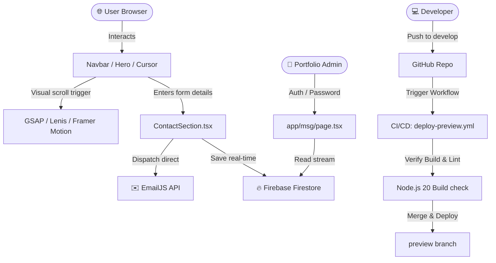

# Abhijith P A — Immersive Digital Portfolio & Client Portal

[](https://nextjs.org/)
[](https://www.typescriptlang.org/)
[](https://tailwindcss.com/)
[](https://gsap.com/)
[](https://firebase.google.com/)
[](https://github.com/features/actions)

Welcome to the source repository for the personal developer portfolio and interactive client portal of **Abhijith P A** (Full Stack Developer). 

This is a premium, ultra-modern Next.js application that integrates high-end interactive animations, custom graphic components, smooth virtual scrolling, real-time Firestore database logging, and automated CI/CD preview deployments.

---

## ⚡ Core Features & Experiences

### 🎨 Immersive User Interface & Aesthetics
* **Ambient glow & custom grain overlay**: Modern retro-futuristic dark mode theme using harmonized CSS tokens, custom backdrop-filters, and glassmorphic surface sheets.
* **Custom Cursor Follower**: Reactive, hardware-accelerated cursor element that dynamic-scales, aligns, and highlights interactive DOM elements.
* **Liquid Motion & Tilt Cards**: Premium interactive feedback driven by Framer Motion, Anime.js, and specialized 3D mouse tilt hooks.
* **Lenis Smooth Scroll**: Elegant scrolling mechanics that unify track speeds and maintain visual synchrony across layouts.

### 📊 Advanced Components & Visualizations
* **Recharts Skill Analytics**: Interactive data visualization of core proficiencies, technical tiers, and development disciplines.
* **Automated Beams & Retro Grid**: Ambient SVG-path connection graphs (`animated-beam.tsx`) and retro CSS perspectives representing platform workflows.
* **Endless Marquee Tickers**: Fluid scrolling technology stacks and infinite lists.

### ✉️ Contact Portal & Secure Admin Dashboard
* **EmailJS Integration**: Seamless form submission forwarding that fires rich user auto-replies and alerts the dashboard.
* **Real-time Firebase Firestore Storage**: Dual-delivery system that writes contact messages directly into a secure Firestore schema.
* **Messages Dashboard (`/msg`)**: Custom password-protected panel providing real-time data retrieval of incoming customer and recruiter inquiries.

---

## 🏗️ Architecture & Data Flow

This chart shows the system architecture, from UI inputs to database storage and automated deployments:



---

## 📂 Repository Structure

Key directories and their contents:

```
├── app/
│   ├── layout.tsx         # Root Layout: Global typography, dark class, Ambient Glow, Grain overlays, Cursor & SmoothScroll
│   ├── page.tsx           # Home composition rendering all major sections
│   ├── globals.css        # Premium global style design system, utilities, variables
│   ├── about/             # About subpage / route
│   ├── works/             # Portfolio work items / projects route
│   ├── msg/               # Real-time administrator messaging dashboard
│   └── contact/           # Dedicated contact view
├── components/
│   ├── ui/                # Low-level layout components (Marquee, Spotlight, RetroGrid, AnimatedBeam)
│   ├── motion/            # Micro-interactions (TiltCard, MagneticButton, RevealText, AnimeCounter)
│   ├── SmoothScroll.tsx   # React wrapper initializing Lenis scroll controls
│   ├── Loader.tsx         # Fluid full-screen percentage preloader
│   ├── SectionWrapper.tsx # Standardized fade-in and scroll trigger wrapper
│   └── *Section.tsx       # Domain specific sections (Hero, About, Skills, Experience, Workflow)
├── lib/
│   ├── firebase.ts        # Double-check initialization guard & firestore exports
│   └── utils.ts           # Class merger helper (clsx + tailwind-merge)
└── .github/workflows/
    └── deploy-preview.yml # Automated CI verification and branch sync workflow
```

---

## ⚙️ Environment Configuration

To run this application locally, you must create a `.env.local` file in the root directory. Copy the template below and supply your respective service credentials:

```bash
# --- FireStore Real-Time Database Credentials ---
NEXT_PUBLIC_FIREBASE_API_KEY=your_firebase_api_key
NEXT_PUBLIC_FIREBASE_AUTH_DOMAIN=your_project.firebaseapp.com
NEXT_PUBLIC_FIREBASE_PROJECT_ID=your_project_id
NEXT_PUBLIC_FIREBASE_STORAGE_BUCKET=your_project.appspot.com
NEXT_PUBLIC_FIREBASE_MESSAGING_SENDER_ID=your_sender_id
NEXT_PUBLIC_FIREBASE_APP_ID=your_app_id

# --- Email Dispatch Credentials (EmailJS) ---
NEXT_PUBLIC_EMAILJS_SERVICE_ID=your_emailjs_service_id
NEXT_PUBLIC_EMAILJS_TEMPLATE_ID=your_emailjs_template_id
NEXT_PUBLIC_EMAILJS_AUTOREPLY_TEMPLATE_ID=your_autoreply_template_id
NEXT_PUBLIC_EMAILJS_PUBLIC_KEY=your_emailjs_public_key

# --- Portal Access Control ---
NEXT_PUBLIC_MSG_DASH_PASSWORD=your_secure_admin_dashboard_password
```

---

## 🚀 Getting Started

Follow these steps to set up, run, and compile the project locally:

### 1. Installation
Clone the repository and install all required modules using strict package locks:
```bash
npm ci
```
*If performing active package audits, you can also use `npm install`.*

### 2. Launch Local Dev Server
Fire up the Next.js development server:
```bash
npm run dev
```
Open [http://localhost:3000](http://localhost:3000) in your browser to view the application.

### 3. Lint Verification
Review layout style syntax and potential Next.js compilation warnings:
```bash
npm run lint
```

### 4. Build Compilation & Production Run
To compile the portfolio for optimal rendering speeds and static exports:
```bash
npm run build
npm start
```

---

## 🛡️ CI/CD Workflow & Preview Automations

This repository includes a continuous integration workflow located in `.github/workflows/deploy-preview.yml`.

### Automated Pipeline Mechanics:
1. **Trigger**: Occurs automatically upon any push to the `develop` branch.
2. **Environment**: Initiated inside an `ubuntu-latest` container running Node.js 20.
3. **Execution Block (`test-build`)**:
   * Installs dependency trees securely via `npm ci`.
   * Runs codebase validation checking with `npm run lint`.
   * Triggers an optimized Next.js compiler build (`npm run build`).
4. **Promotion Block (`update-preview`)**:
   * If the compilation successfully completes without errors, the runner automatically checkouts `preview`.
   * Merges `develop` updates into `preview` without editing git history.
   * Pushes the verified build payload back to the remote `preview` branch for instant edge deployment.
